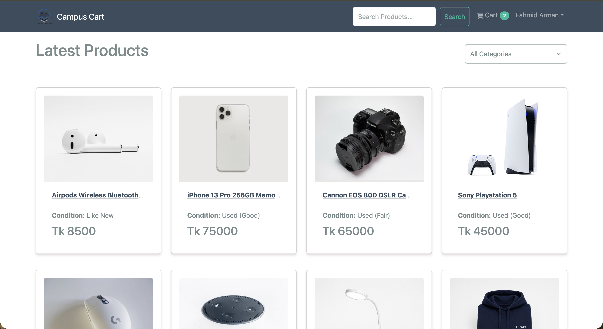
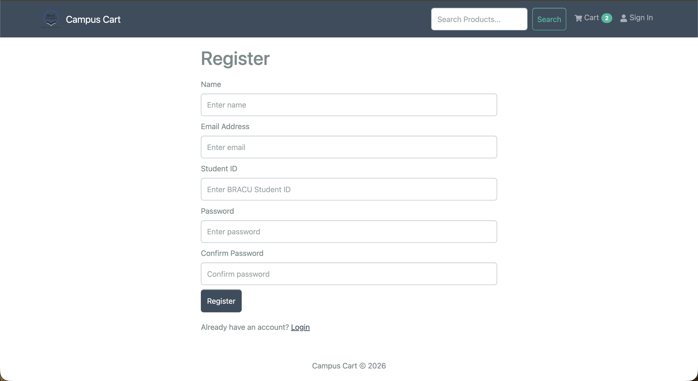
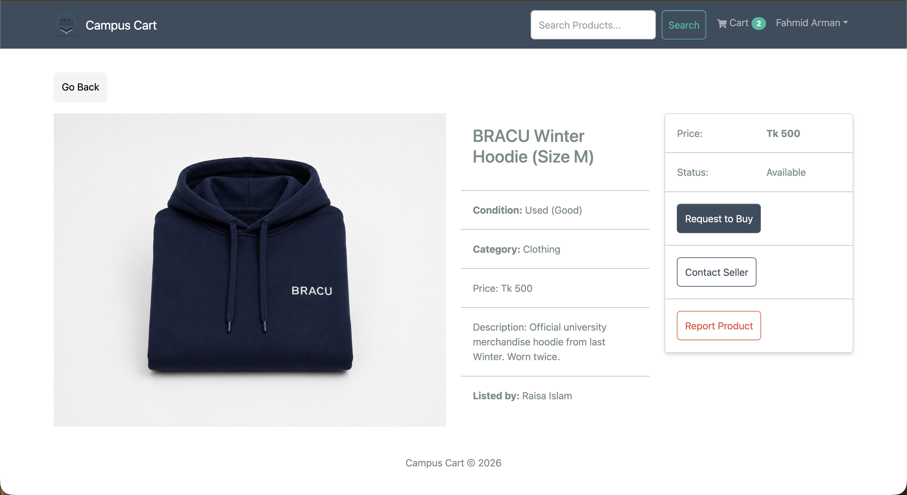
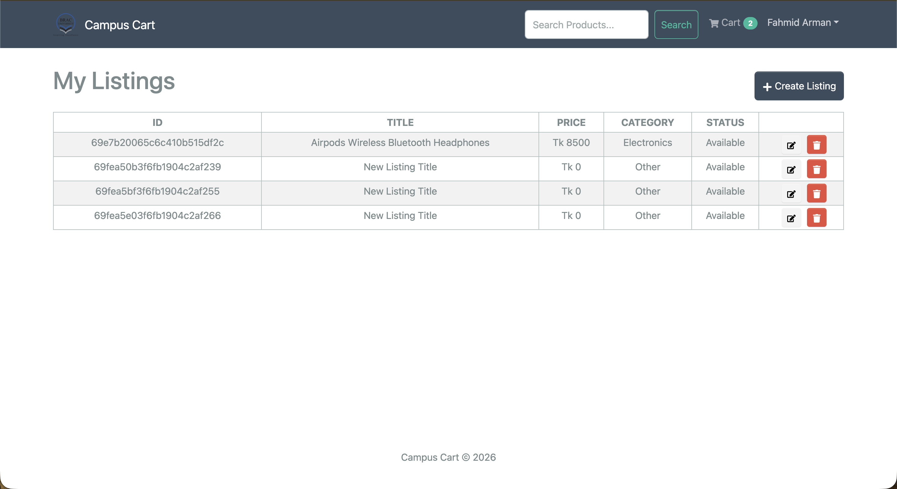
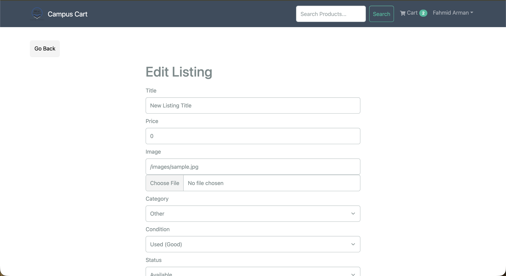
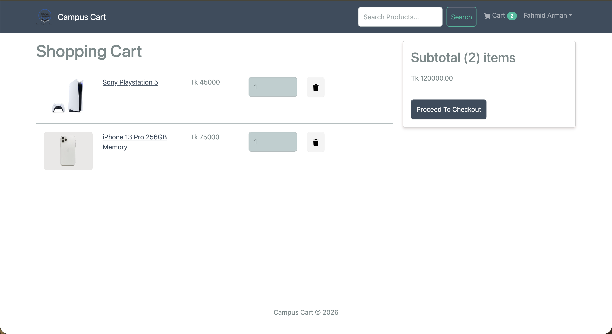
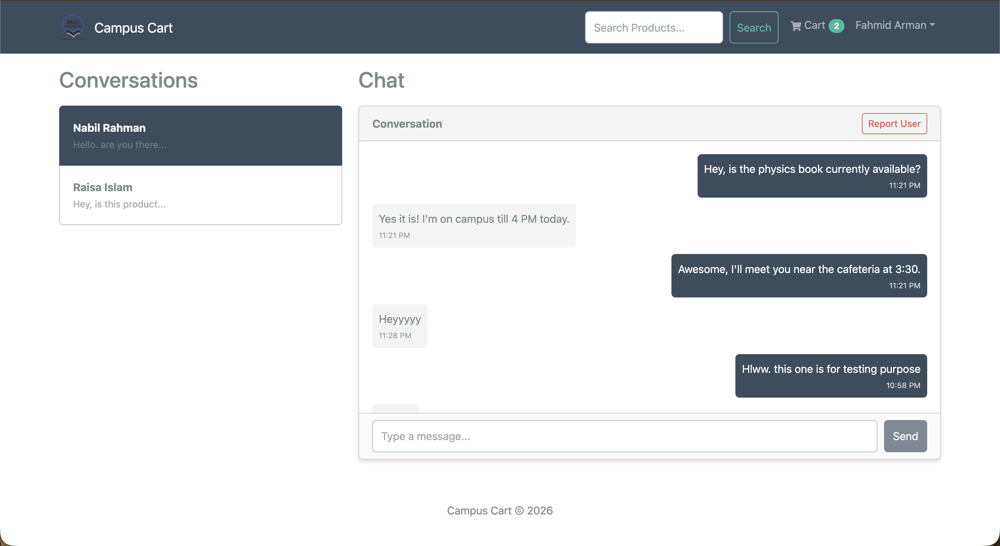
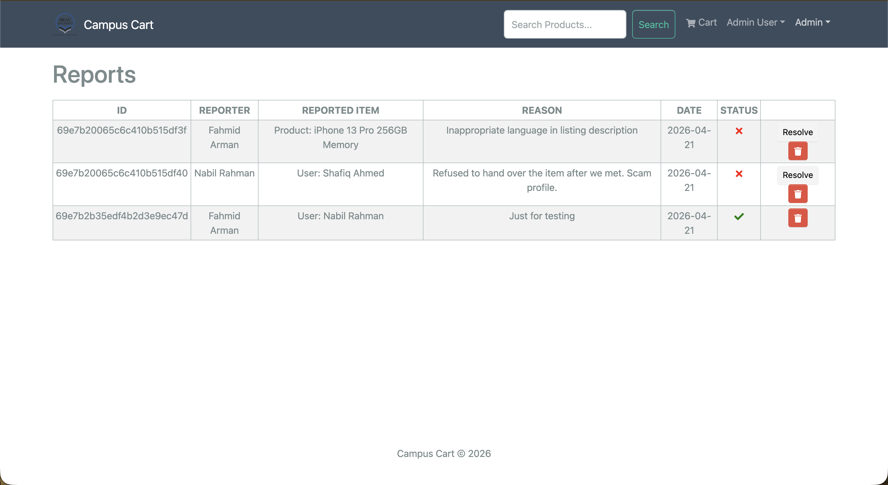

# Campus Cart - BRACU Student Marketplace

[](https://choosealicense.com/licenses/mit/)
[](https://www.mongodb.com/mern-stack)

Campus Cart is a student marketplace platform for BRAC University students to buy, sell, and manage second-hand products. The project focuses on user authentication, product management, search and filtering, seller dashboard, shopping cart flow, messaging, reporting, and admin moderation.

---

## 🌟 Key Features

- **🛍️ Complete Marketplace**: Search, filter by category, and view detailed product listings.
- **💬 Real-time Messaging**: Integrated chat system for buyers and sellers to negotiate securely.
- **🛡️ Content Moderation**: Built-in reporting system and administrator dashboard for platform safety.
- **📊 Seller Dashboard**: Dedicated space for sellers to manage listings, track orders, and upload images.
- **🛒 Smooth Checkout**: Seamless shopping cart experience with order tracking.
- **🔐 Secure Auth**: JWT-based authentication with student ID verification.

---

## 🛠️ Tech Stack

**Frontend:**
- React.js with Hooks
- Redux Toolkit (State Management)
- RTK Query (Data Fetching & Caching)
- React-Bootstrap (UI/UX)

**Backend:**
- Node.js & Express.js
- JWT & Cookie-based Authentication
- Multer (Image Processing)

**Database:**
- MongoDB & Mongoose (ODM)

---

## 📁 Project Structure

```text
├── backend/            # Express server, routes, controllers, and models
├── frontend/           # React application (Redux, components, screens)
├── uploads/            # Local storage for product images
├── docs/               # Detailed project documentation
├── database/           # Schema and database notes
└── .env.example        # Environment variables template
```

---

## 🚀 Getting Started

### Prerequisites
- Node.js (v16 or higher)
- MongoDB (Local or Atlas)

### Installation

1. **Clone the repository:**
   ```bash
   git clone https://github.com/Fahmid-Arman/campus-cart.git
   cd campus-cart
   ```

2. **Install dependencies:**
   ```bash
   # Install root dependencies
   npm install

   # Install frontend dependencies
   cd frontend
   npm install
   cd ..
   ```

3. **Setup Environment Variables:**
   Create a `.env` file in the root directory and copy the contents from `.env.example`.
   ```bash
   cp .env.example .env
   ```

4. **Run the project:**
   ```bash
   # Run both backend and frontend simultaneously
   npm run dev
   ```

---

## Screenshots

### Home Page / Product Listing


### Login / Register


### Product Details


### Seller Dashboard


### Add Product


### Cart Page


### Chat Page


### Admin Dashboard


---

## 🎓 What I Learned
During the development of Campus Cart, I gained hands-on experience with:
- Implementing **token-based authentication** using JWT and securing it via HTTP-only cookies.
- Designing a **scalable NoSQL database schema** for complex relationships.
- Managing global application state and optimizing performance using **Redux Toolkit Query**.
- Building a robust **RESTful API** that handles CRUD operations and image uploads efficiently.

---

## 💡 Future Enhancements
- Integration of local payment gateways (bKash/SSLCommerz).
- Real-time notifications using Socket.io.
- Verified user badges for trusted campus sellers.
- Deployment to a cloud platform (AWS/Heroku).

---

## 🧔 Author

**Fahmid Arman**
- [GitHub](https://github.com/Fahmid-Arman)
- [LinkedIn](https://www.linkedin.com/in/fahmid-arman/)
- [LeetCode](https://leetcode.com/u/Fahmid_Arman/)

---

## 📄 License
This project is licensed under the MIT License - see the [LICENSE](LICENSE) file for details.
