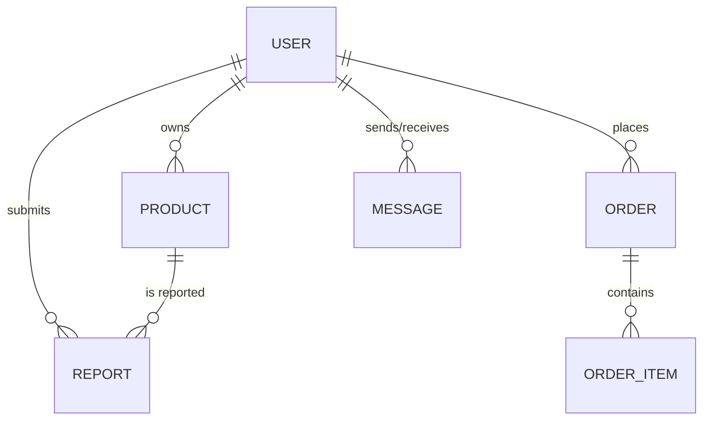

# Database Schema Overview

## Collection Relationships

## Schema Definitions

### User
| Field | Type | Note |
| :--- | :--- | :--- |
| _id | ObjectId | Auto-generated |
| name | String | Full name |
| email | String | Unique |
| password | String | Hashed |
| studentId | String | University ID |
| isAdmin | Boolean | Admin privileges |
| isSuspended | Boolean | Account status |

### Product
| Field | Type | Note |
| :--- | :--- | :--- |
| seller | ObjectId | Ref: User |
| title | String | Listing name |
| image | String | Path to image |
| category | String | Electronics/Books/etc. |
| condition | String | Brand New/Used/etc. |
| price | Number | BDT |
| status | String | Available/Sold |

### Message
| Field | Type | Note |
| :--- | :--- | :--- |
| sender | ObjectId | Ref: User |
| receiver | ObjectId | Ref: User |
| content | String | Text content |
| isRead | Boolean | Notification status |
